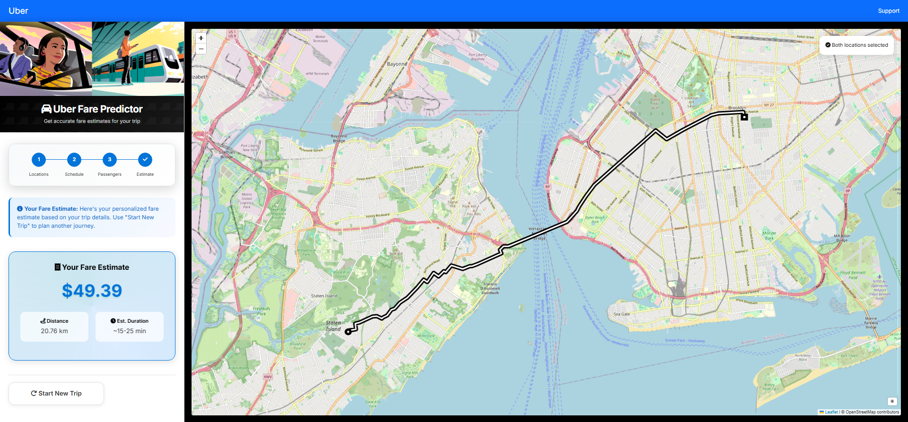

# 🚖 Uber Fare Prediction with XGBoost & OSMnx

This project focuses on **Uber Inc.**, the world's largest taxi company. The main goal is to **predict the fare amount** for future trips using **machine learning models**. By leveraging **real road distances from OSMnx** instead of Euclidean straight-line distances, the prediction model achieves **higher accuracy** and provides more realistic estimates.  

---

## 🔧 Key Features

| Feature                  | Description                                                                 |
|---------------------------|-----------------------------------------------------------------------------|
| 🧹 **Data Cleaning**      | Handle missing values, outliers, and incorrect passenger counts             |
| 🌍 **Road Network Distance** | Compute **real driving routes** using **OSMnx** instead of Euclidean distance |
| ⚡ **Machine Learning**   | Implemented **XGBoost** regression for fare prediction                      |
| 📊 **Evaluation Metrics** | Compared model performance using **R², RMSE, and MAE**                      |
| 🎨 **Web App Deployment** | Flask-based interface to test predictions interactively                     |

---

## 📊 Dataset
The dataset (sourced from **Kaggle**) contains the following fields:

- **key** → unique identifier for each trip  
- **fare_amount** → cost of each trip in USD  
- **pickup_datetime** → date and time when the meter was engaged  
- **passenger_count** → number of passengers in the vehicle (driver-entered)  
- **pickup_longitude** → longitude where the meter was engaged  
- **pickup_latitude** → latitude where the meter was engaged  
- **dropoff_longitude** → longitude where the meter was disengaged  
- **dropoff_latitude** → latitude where the meter was disengaged  

---

## 🎯 Objective
1. Understand and clean the dataset (if required).  
2. Build **regression models** to predict Uber ride fares.  
3. Evaluate and compare models using **R², RMSE, and MAE**.  

---

## 🗂️ Project Structure
<pre>
project/
├── app.py               
├── prepare_input.py     
├── requirement.txt
├── xgb_fare_model.json   
├── static/             
│   ├── style.css        
│   ├── script.js        
│   └── images/          
└── templates/           
    └── index.html   
</pre>

---

## 🎥 Web Interface

  

---

## 📈 Results

| Metric | Value |
|--------|-------|
| 🧮 **MAE**  | 1.918 |
| 📏 **RMSE** | 3.679 |
| 📊 **R²**   | 0.831 |

Since the dataset is synthetic, certain features may not be correlated, and therefore the accuracy is slightly affected.

---

## 🧪 How to Run Locally
1. Install dependencies  
<pre>pip install -r requirements.txt</pre>
2. Run the app  
<pre>python app.py</pre>
3. Open in browser  
<pre>http://localhost:5000</pre>

---

✨ Takeaway: This project combines geospatial analysis (OSMnx) with machine learning (XGBoost) and web deployment (Flask), showcasing an end-to-end workflow from raw data to an interactive prediction system.
